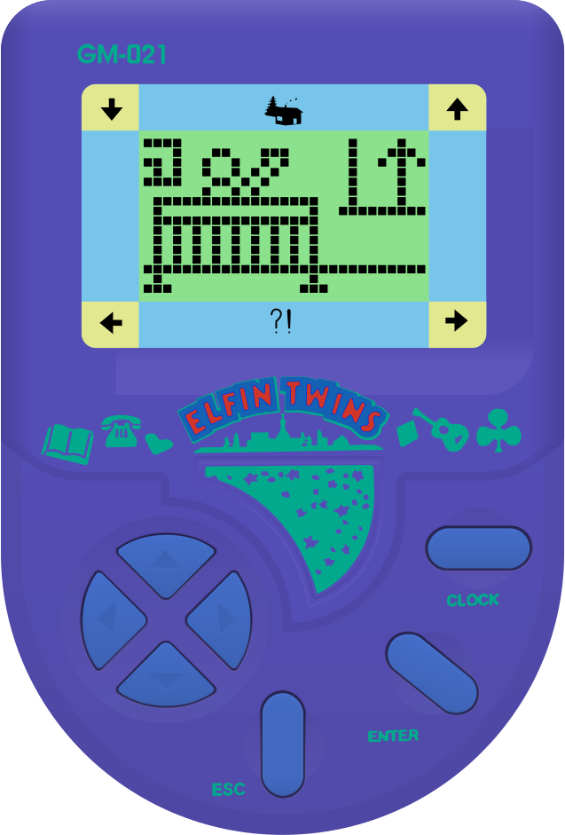
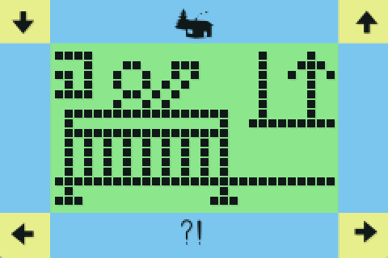
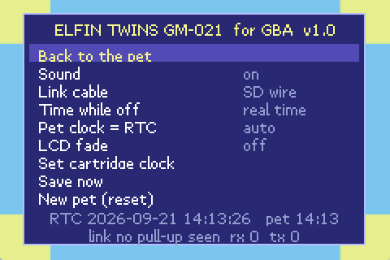

# Elfin Twins GM-021 for Game Boy Advance



The Elfin Twins GM-021 is a small virtual pet from 1996, the same era as the first Tamagotchi. You look
after a pair of twins: you feed them, put them to bed, take them out and nurse them when they're ill. It's
a charming little toy, and it has almost vanished. There's no manual to be found, hardly anything online,
and not many units left.

This repository is our attempt to keep it around. It has:

- a **Game Boy Advance version** that runs the toy's original program, so the twins behave exactly as they
  do on the real thing;
- an illustrated **instruction manual**, written from scratch because the original one is lost;
- a **technical reference** covering how the toy works, from the chip up to the game rules;
- an **annotated disassembly** of the entire ROM.

None of this would have been possible without [BrickEmuPy](https://github.com/azya52/BrickEmuPy), azya52's
emulator for handheld LCD games. azya52 dumped this toy, drew its artwork and emulated its chip, and we built
on that.

<br clear="right">

<p align="center">
  
  
</p>

## Get it

- **The game:** [`gba/release/elfin-twins.gba`](gba/release/elfin-twins.gba)
- **The link and clock tester:** [`gba/release/elfin-linktest.gba`](gba/release/elfin-linktest.gba)
- **The manual:** [Elfin_Twins_GM-021_Manual.pdf](gba/docs/Elfin_Twins_GM-021_Manual.pdf)
- **The technical reference:** [Elfin_Twins_GM-021_Technical_Reference.pdf](gba/docs/Elfin_Twins_GM-021_Technical_Reference.pdf)
- **The disassembly:** [elfin_twins.asm](gba/docs/analysis/elfin_twins.asm)

## Playing it

Put `elfin-twins.gba` on your flashcart and, in the flashcart's menu, turn on the **real-time clock** and
**SRAM saving** for it. It also runs in emulators such as mGBA.

The buttons map across like this:

| GBA | Toy |
|---|---|
| A | ENTER |
| B | ESC |
| D-pad | the four arrows |
| SELECT, L or R | CLOCK |
| A and B together | ESC + ENTER (rescue, or a new pair of twins) |
| START | the GBA settings menu |

A few things the GBA version adds:

- **The twins keep living while the GBA is off.** When you switch it back on, the game works out how long
  you were away and plays through that time in a couple of seconds. So yes, they'll be hungry in the
  morning. Feed them before you go.
- **It saves on its own**, a few seconds after you press a button.
- **Two GBAs can play together over a link cable**, using the GBA's hardware Multi-Player SIO transport.
The connection path is covered by the GBA build checks and the original Elfin pulse protocol is preserved above the transport. The remaining validation step is a two-real-GBA hardware session; this environment cannot perform that physical test.
because it depends on a small detail of the toy's chip that we still need to confirm on hardware. If you
test it, we'd love to hear how it went.

## A few things we found inside

Going through the ROM turned up some surprises. The PDFs have the full story, but here are the best bits:

- **The programmers signed their work.** Near the end of the ROM, disguised so it doesn't show up in a plain
  text search, is the line *"Sparkle Crystal Development Co.,Ltd. WangLaXian 1996.11.16"*. We couldn't find
  anything else about the company. If you know something, please tell us!
- **There's a secret test mode.** At the end of the opening story, sign the name `SCD  TEST` (the company's
  initials, with two spaces). ENTER then skips a day, ESC skips ten minutes, and holding ESC moves the
  twins on to their next growth stage.
- **The chip maker left a factory test in there too.** The first kilobyte is Sunplus's own test program. It
  can check the screen, the buzzer and the memory, and one of its tests writes "SUNPLU…" across the display.

## Building it yourself

To build the ROMs you need either devkitARM or a plain `arm-none-eabi-gcc` with newlib (Ubuntu's
`gcc-arm-none-eabi` works fine), plus Python 3. The GBA library, libtonc, is included.

```sh
make -C gba/elfin       # builds gba/elfin/elfin-twins.gba
make -C gba/linktest    # builds gba/linktest/elfin-linktest.gba
```

If you use devkitPro, set `DEVKITARM` first. Either way, the result should match the files in `gba/release/`
exactly.

To check the emulation yourself, you'll need `gcc`, the Python packages in `requirements.txt`, and
`libmgba-dev` for the headless mGBA runner. The main check runs our C version of the chip side by side
with BrickEmuPy's and compares them after every single instruction:

```sh
python3 gba/host/verify_core.py 18000000
```

There are more tests in `gba/host/`: the time-away catch-up against full emulation, the link cable
between two emulated toys, and the speed-up tricks against plain step-by-step emulation. The disassembly
and the PDFs can be regenerated with the scripts in `gba/tools/` and `gba/docs/tools/`. The pictures in the
manual come from running the real ROM, so they show exactly what the toy shows.

## What's where

```
assets/        the toy's ROM, artwork and button wiring (from BrickEmuPy)
cores/         BrickEmuPy's SPLB20 emulator, kept as the reference we test against
gba/core/      our C version of the chip, the time-away catch-up and the link bridge
gba/common/    the cartridge clock driver and the link port helpers
gba/elfin/     the GBA game itself
gba/linktest/  the link and clock tester
gba/tools/     build rules, asset converter, disassembler and symbol table
gba/host/      tests and the simulator used for the research
gba/docs/      the PDFs, their sources, figures, fonts and generators, and the disassembly
gba/release/   ready-made ROMs
```

## Thanks

A big thank you to **azya52**. BrickEmuPy did the hard groundwork: the chip emulation, the ROM dump, the
toy's artwork and its wiring. azya52 released all of it into the public domain (CC0). Nobody asked for
credit, but it's well deserved.

Thanks also to **t.me/oksiniah**, who provided the Elfin Twins unit that was dumped. Without it, there would
be nothing to preserve.

This project also uses **libtonc** by J. Vijn (MIT licence) and fonts from Google Fonts (SIL Open Font
License), and was tested with **mGBA**. The port, the research and the documents are by codanric, with
help from Claude Code. [CREDITS.md](CREDITS.md) has the details.

## Licence

Our code is under the [MIT licence](LICENSE). The manual, the technical reference, the figures and the
disassembly's comments are under [CC BY 4.0](LICENSE-docs), so feel free to share and adapt them, as long
as you give credit. The parts that came from elsewhere keep their own licences (see [CREDITS.md](CREDITS.md)).

The Elfin Twins game itself, meaning its program, graphics and tunes, belongs to its original makers. It isn't
covered by these licences. This is an unofficial, non-commercial project, made because we'd hate to see the
toy forgotten.
